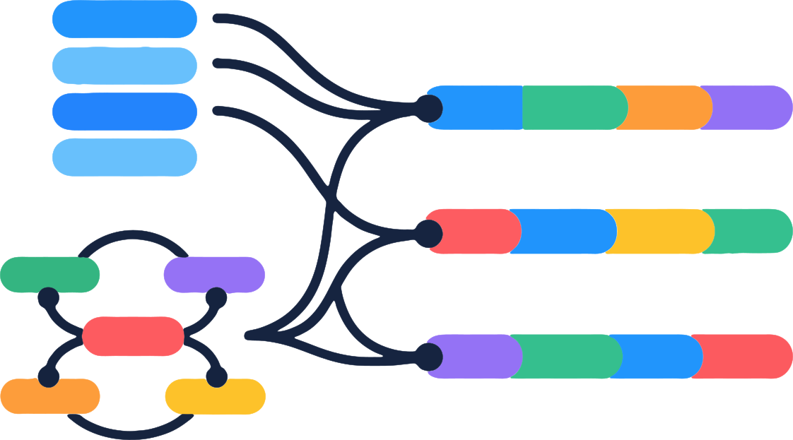
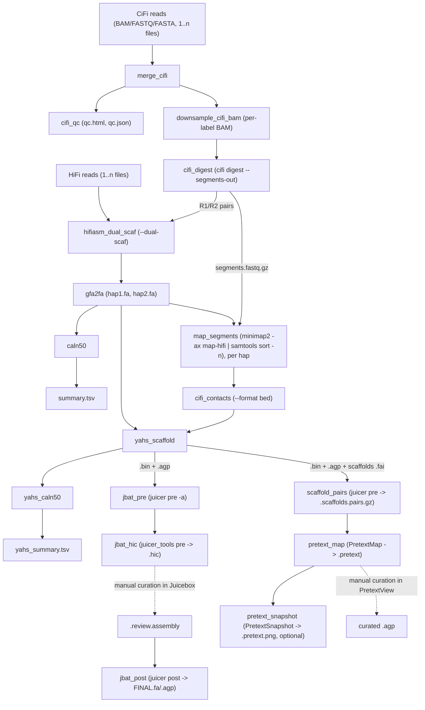

<p align="center">
  
</p>

# cifiasm

cifiasm builds phased, chromosome-scale genome assemblies from PacBio HiFi and
CiFi reads using Snakemake. It assembles the two haplotypes with hifiasm,
scaffolds them with YaHS, and prepares contact maps for manual curation in
Juicebox or PretextView.

You need HiFi reads, CiFi reads, and the restriction enzyme used for the CiFi
library. Both read sets can be BAM, FASTQ, or FASTA; compressed FASTQ and FASTA
are supported, as are multiple files per sample.

[Workflow](#workflow) · [Installation](#installation) · [Run the pipeline](#run-the-pipeline) ·
[Outputs](#outputs) · [Rules](#rules) · [Citation](#citation)

## Workflow



QC runs once per sample. Digestion and assembly run for each CiFi label;
mapping, scaffolding, and contact maps run separately for each haplotype.
Dashed arrows mark manual curation steps.

CiFi pairs feed assembly, while individual segments are mapped once per
haplotype for scaffolding. Both contact-map routes reuse the scaffolding
contacts and layout; neither requires another alignment.

## Installation

Clone the repository and create the Conda environment:

```bash
git clone https://github.com/mydennislab/cifiasm.git
cd cifiasm
conda env create -f environment.yaml
conda activate cifiasm
```

The environment includes Snakemake, the SLURM executor, hifiasm, minimap2,
samtools, [YaHS](https://github.com/c-zhou/yahs),
[PretextMap](https://github.com/wtsi-hpag/PretextMap),
[PretextSnapshot](https://github.com/wtsi-hpag/PretextSnapshot), and the
[CiFi toolkit](https://github.com/mydennislab/cifi-toolkit).
cifiasm uses CiFi 1.1.0; the environment allows 1.1.0 or later. See
[environment.yaml](environment.yaml) for the full dependency list.

Juicebox contact maps also require a JuicerTools JAR with the `pre` command.
Download it into the repository directory:

```bash
wget https://s3.amazonaws.com/hicfiles.tc4ga.com/public/juicer/juicer_tools_1.22.01.jar
```

## Configure your samples

Copy the example configuration:

```bash
cp config.example.yaml config.yaml
```

Edit the `samples` section with your input paths and restriction enzyme:

```yaml
samples:
  my_sample:
    hifi: /data/my_sample.hifi.bam
    cifi: /data/my_sample.cifi.bam
    enzyme: HindIII
```

For multiple sequencing files, use a list under `hifi` or `cifi`:

```yaml
    hifi:
      - /data/my_sample.hifi.cell1.bam
      - /data/my_sample.hifi.cell2.fastq.gz
```

Add more sample entries to process them in the same run. HiFi reads are always
used at full depth. CiFi reads are merged per sample before QC and digestion.

The comments in [config.example.yaml](config.example.yaml) document the
settings, including custom restriction sites, CiFi downsampling,
pre-downsampled inputs, filtering, thread counts, and contact-map outputs.

## Outputs

Results are written under `results/` unless you change `output_dir`.
Each run has a sample name and a CiFi label: the default label, `100`, uses
all CiFi reads. Assembly, scaffolding, and contact-map outputs are produced
for both `hap1` and `hap2`.

```
results/
├── benchmarks/{rule}/                         per-job time and memory TSVs
├── qc_cifi/{sample}/
│   └── qc.html, qc.json, qc.pdf                 PDF requires matplotlib
├── hifi/{sample}/cell{n}.fastq                  converted HiFi BAM inputs
├── cifi/merged/{sample}.cifi.bam                merged CiFi inputs
├── cifi/{sample}.{label}.bam                    CiFi input per label, no index
├── cifi2pe/
│   ├── {sample}.{label}_R{1,2}.fastq            pairs for hifiasm
│   ├── {sample}.{label}.segments.fastq.gz      unique segments for mapping
│   ├── {sample}.{label}_stats.json
│   └── {sample}.{label}_digestion_report.html
├── asm/{sample}/{label}/*.hap{1,2}.fa, *.fa.fai  hifiasm contigs and indexes
├── mapping/{sample}/{label}/hap{1,2}/
│   └── *.segments.ns.bam                      name-sorted segment alignments
├── contacts/{sample}/{label}/hap{1,2}/
│   ├── *.bed                                 CiFi contacts for YaHS
│   └── *_contacts_stats.json, *_contacts_report.html
├── yahs/{sample}/{label}/
│   ├── *_scaffolds_final.fa, *_scaffolds_final.agp
│   ├── *_scaffolds_final.fa.fai
│   └── *.bin                                 YaHS contacts
├── jbat/{sample}/{label}/hap{1,2}/
│   ├── *.txt, *.assembly, *.liftover.agp, *.assembly.agp
│   ├── *.chrom.sizes, *.scale_factor.txt, *.log
│   ├── *.hic                                 Juicebox map
│   └── *.FINAL.fa, *.FINAL.agp                 after manual curation
├── contact_maps/{sample}/{label}/hap{1,2}/
│   ├── *.scaffolds.pairs.gz, *.scaffolds.pairs.log
│   ├── *.pretext, *.pretext.log               Pretext map
│   └── *.pretext.png, *.pretext.png.log        PNG preview
└── stats/{sample}/{label}/summary.tsv, yahs_summary.tsv
```

R1/R2 files end in `.fastq.gz` when `cifi.digest.gzip` is enabled. Select
contact-map outputs in the `contact_maps` section of
[config.example.yaml](config.example.yaml). Scaffold contacts are exported
in 4DN pairs format, version 1.0; Pretext maps use the scaffold order in the
`.fai` file.

Resource-intensive rules write [Snakemake benchmarks](https://snakemake.readthedocs.io/en/stable/snakefiles/rules.html#benchmark-rules)
under `benchmarks/`, grouped by rule and sample, with label, haplotype, or input
cell where applicable. The TSV columns include elapsed seconds (`s`), CPU
seconds (`cpu_time`), and peak sampled memory in MiB (`max_rss`).

The default run stops at scaffolds and contact maps. For manual curation,
see the [Juicebox assembly guide](https://aidenlab.org/assembly/) or
[PretextView documentation](https://github.com/sanger-tol/PretextView#usage).

To build only the contig or scaffold statistics and their dependencies:

```bash
snakemake --cores 32 results/stats/my_sample/100/summary.tsv
snakemake --cores 32 results/stats/my_sample/100/yahs_summary.tsv
```

## Rules

The [Snakefile](Snakefile) defines shared configuration and `rule all`;
the rules are grouped under [rules/](rules/). Keep `rules/` and `scripts/`
alongside the Snakefile when copying or symlinking the workflow elsewhere.

| Rule | What it does |
|------|--------------|
| `merge_cifi` | Combine CiFi inputs into one unmapped BAM per sample |
| `cifi_qc` | Generate CiFi QC reports |
| `hifi_bam_to_fastq` | Convert HiFi BAM inputs to FASTQ; FASTQ and FASTA inputs skip this step |
| `downsample_cifi_bam` | Prepare a CiFi BAM for each label |
| `cifi_digest` | Generate read pairs, segments, and digestion reports |
| `hifiasm_dual_scaf` | Assemble phased contigs from HiFi reads and CiFi pairs |
| `gfa2fa`, `index_fa` | Write and index each haplotype's contig FASTA |
| `caln50`, `summarize_assembly` | Calculate contig statistics with calN50.js |
| `map_segments` | Align CiFi segments to each haplotype |
| `cifi_contacts` | Generate scaffolding contacts and reports |
| `yahs_scaffold` | Scaffold each haplotype using CiFi contacts |
| `yahs_caln50`, `summarize_yahs` | Calculate scaffold statistics |
| `jbat_pre` | Prepare Juicebox curation files and the scale factor |
| `jbat_hic` | Generate the `.hic` contact map |
| `jbat_post` | Build the curated FASTA and AGP from a reviewed assembly |
| `index_scaffolds_fa` | Index the YaHS scaffold FASTA for the pairs header |
| `scaffold_pairs` | Export contacts in scaffold coordinates as a 4DN pairs file |
| `pretext_map` | Generate a Pretext contact map |
| `pretext_snapshot` | Export a PNG preview when requested |

The repository includes two helper scripts:

- [scaffold_pairs.sh](scripts/scaffold_pairs.sh): scaffold-coordinate pairs export.
- [calN50.js](scripts/calN50.js): assembly statistics, from Heng Li's [calN50](https://github.com/lh3/calN50).

## Citation

If you use cifiasm, please cite:

Abuelanin M, Kaya G, Lake JA, Lambert C, Wu MV, Berendzen KM, Wood J,
Krasheninnikova K, Solomon NG, Donaldson ZR, Bales KL, Howe K, Korlach J,
Manoli D, Tollkuhn J, Dennis MY. (2026).
[Single-library chromosome-scale diploid assemblies of vole genomes resolve a species-specific duplication implicated in pair bonding](https://www.cell.com/cell-genomics/fulltext/S2666-979X%2826%2900198-9).
*Cell Genomics*, 101336.
[doi:10.1016/j.xgen.2026.101336](https://doi.org/10.1016/j.xgen.2026.101336).

## License

[MIT](LICENSE).
